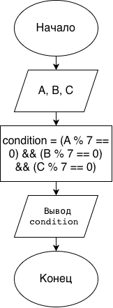

# Домашнее задание к работе 4

## Условие задачи
Контроль качества на фабрике игрушек пропускает партию, если вес каждой из трех случайно выбранных игрушек (**A**, **B**, **C** грамм) кратен семи. Это свидетельствует о соблюдении технологических норм. Запишите условие принятия партии.

## 1. Алгоритм и блок-схема

### Алгоритм
1. **Начало**
2. Задать исходные данные (ввод с клавиатуры):
   - `A` — вес первой игрушки (в граммах).
   - `B` — вес второй игрушки (в граммах).
   - `C` — вес третьей игрушки (в граммах).
3. Проверить логическое условие принятия партии:
   - `condition` = (`A` % 7 == 0) И (`B` % 7 == 0) И (`C` % 7 == 0)
4. Вывести значение флага `condition` (1 — партия пропущена, 0 — партия отклонена).
5. **Конец**

### Блок-схема
 

## 2. Реализация программы

```c
#include <stdio.h>

int main() {
    int A, B, C;
    int condition;

    printf("=== КОНТРОЛЬ КАЧЕСТВА НА ФАБРИКЕ ИГРУШЕК ===\n");
    printf("Введите вес трех игрушек (A, B, C): ");
    scanf("%d %d %d", &A, &B, &C);

    condition = (A % 7 == 0) && (B % 7 == 0) && (C % 7 == 0);

    printf("Партия пропущена (1 - да, 0 - нет): %d\n", condition);

    return 0;
}
```

## 3. Результаты работы программы

```text
=== КОНТРОЛЬ КАЧЕСТВА НА ФАБРИКЕ ИГРУШЕК ===
Введите вес трех игрушек (A, B, C): 14 21 35
Партия пропущена (1 - да, 0 - нет): 1
```

## 4. Информация о разработчике

Цимбалист Костя бИЦТ-261
